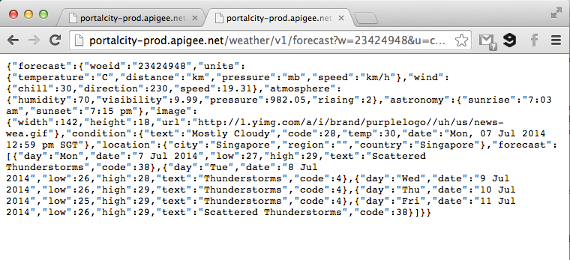
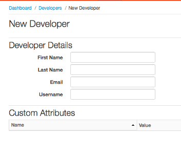
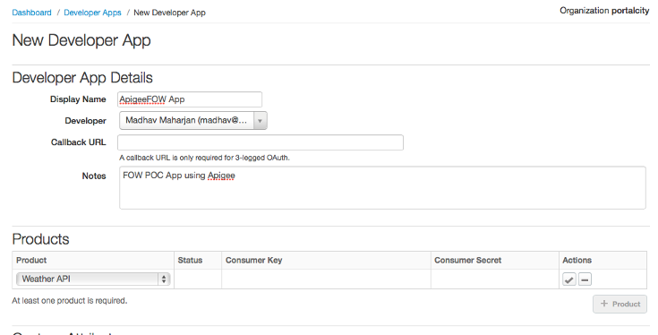
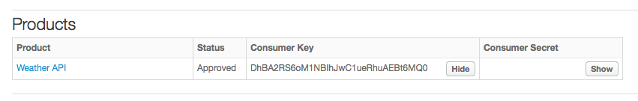

# Apigee FOW #

### POC using Apigee ###

This README.md documents all the step carried out in building Apigee POC application.


## 1) API (enteprise) Developer Flow ##

Following instructions are based on **Apgiee Developer (Free) Account**, Thus evaluation of features below are **NOT** included.

* **SmartDocs**, 
* **Developer Portal**,
* **Monetize**

### a) Weather API on Apigee Edge ###

Create Apigee Developer Account and follow the instruction below to create `Product` (packing of APIs)

* **Create Weather API Proxy for Yahoo! Weather**
[view detail instructions](doc/api-create-weather-api.md)


  
`http://portalcity-prod.apigee.net/woeid/v1/search?q=singapore&apikey=zgkZmV9GOEKZljFpG4Ko5cpqRok9zA0x`


`http://portalcity-prod.apigee.net/weather/v1/forecast?w=23424948&u=c&apikey=zgkZmV9GOEKZljFpG4Ko5cpqRok9zA0x`



### b) Weather API Console on Apigee Edge ###

Create Console for Weather API, for  independent developer to Test Weather API **WITHOUT** writing any code.

* **Console to Test Weather API**
[view instruction](doc/api-create-weather-console.md)


[https://apigee.com/madhav.maharjan/embed/console/portalcity](https://apigee.com/madhav.maharjan/embed/console/portalcity)


## 2) API (independent) Developer Flow ##

### a) Register of Developer App ###

* **Create Apigee Developer Account and register of Weather API Product**



* **Create Developer App and request for API Key**







**For Apigee Enterprise Account, above feature to register for developer account and request for API key would be available on `Developer Portal`**

### b) Create iOS to consume Weather API ###

* **Creating Git Repository**
[view instruction](doc/create-git.md)

* **Installing Apigee iOS SDK using CocoaPods**
[view instruction](doc/install-cocoapods.md)

```
#Podfile
pod 'ApigeeiOSSDK', '~> 2.0'
pod 'MBProgressHUD', '~> 0.8'
pod 'AsyncImageView', '~> 1.5'

$pod install
```

* **Adding Apigee Client to the iOSApp, Build and Test**
[view instruction](doc/add-apigeeclient.md)

* **Configure Push Notification**
[view instruction](doc/config-notification.md)

* **Adding Signup, Login and Logout to the iOSApp**
[view instruction](doc/add-signup-login-logout.md)

* **Adding Sliding Menu**
[view instruction](doc/add-sliding-menu.md)


### c) Call Weather API from iOSApp ###

* **Calling Weoid-Search**
[view instruction](doc/add-woeid-api.md)

* **Calling Weather-Forecast**
[view instruction](doc/add-forecast-api.md)


