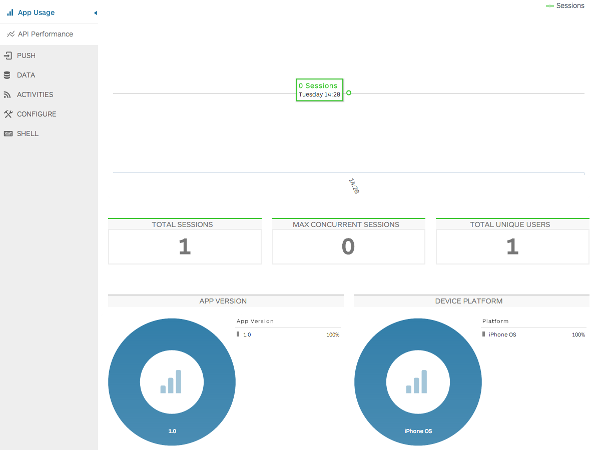

### POC using Apigee ###

### Adding Apigee Client ###

**Add Global object to encaplulate Apigee Client**

Create [Global.h](iOSApp/iOSApp/Global.h) as shown below

```
#import <Foundation/Foundation.h>
#import <ApigeeiOSSDK/Apigee.h>

@interface Global : NSObject{}

@property (strong, nonatomic) ApigeeClient *apigeeClient;
@property (strong, nonatomic) ApigeeMonitoringClient *monitoringClient;
@property (strong, nonatomic) ApigeeDataClient *dataClient;
@property (strong, nonatomic) ApigeeClientResponse *response;

+ (id)sharedGlobal;

+ (void) alert:(NSString*) message withTitle:(NSString*) title buttonTitle:(NSString *) buttonTitle;

- (void) initializeWithOrgName:(NSString*) OrgName andAppName:(NSString*) appName;

- (BOOL) login:(NSString*) username withPassword:(NSString*) password;
- (BOOL) signup:(NSString *) username email:(NSString*) email fullname:(NSString*) fullname password:(NSString*) password;
- (ApigeeUser *) getUser;
- (void) logOut;

- (ApigeeClientResponse *) getLastResponse;

@end
```

Create [Global.m](iOSApp/iOSApp/Global.m) as shown below

```
import "Global.h"

@implementation Global

+ (id)sharedGlobal
{
    static dispatch_once_t pred = 0;
    __strong static id _sharedObject = nil;
    dispatch_once(&pred, ^{
        _sharedObject = [[self alloc] init]; // or some other init method
    });
    return _sharedObject;
}

+ (void) alert:(NSString*) message withTitle:(NSString*) title buttonTitle:(NSString *) buttonTitle
{
    UIAlertView * alert = [[UIAlertView alloc]initWithTitle:title
                                                    message:message
                                                   delegate:nil
                                          cancelButtonTitle:buttonTitle
                                          otherButtonTitles:nil];
    [alert show];
}

- (void) initializeWithOrgName:(NSString*) orgName andAppName:(NSString*) appName
{
    self.apigeeClient = [[ApigeeClient alloc] initWithOrganizationId:orgName applicationId:appName];
    self.monitoringClient = [self.apigeeClient monitoringClient];
    self.dataClient = [self.apigeeClient dataClient];
    
    [self.dataClient setLogging:true];

}

- (BOOL) login:(NSString*) username withPassword:(NSString*) password
{
    self.response = [self.dataClient logInUser:username password:password];
    if ([self.response completedSuccessfully])
    {
        ApigeeUser *user = [self.dataClient getLoggedInUser];
        if (user.username)
        {
            return YES;
        }
    }
    return NO;
}

- (BOOL) signup:(NSString *) username email:(NSString*) email fullname:(NSString*) fullname password:(NSString*) password
{
    self.response = [self.dataClient addUser:username email:email name:fullname password:password];
    if ([self.response completedSuccessfully])
    {
        return YES;
    }
    return NO;
}

- (ApigeeUser *) getUser
{
    return [self.dataClient getLoggedInUser];
}

- (ApigeeClientResponse *) getLastResponse
{
    return self.response;
}

- (void) logOut
{
    [self.dataClient logOut];
}

@end

```

**Update AppDelegate of IOSApp**

Update content of [AppDelegate.m](iOSApp/iOSApp/AppDelegate.m) as shown below

```
#import "Global.h"
...
- (BOOL)application:(UIApplication *)application didFinishLaunchingWithOptions:(NSDictionary *)launchOptions
{   
    NSString *orgName = @"portalcity";
    NSString *appName =@"fow";
    
    Global *global = [Global sharedGlobal];
    [global initializeWithOrgName:orgName andAppName:appName];
    
//    self.window = [[UIWindow alloc] initWithFrame:[[UIScreen mainScreen] bounds]];
//    // Override point for customization after application launch.
//    self.window.backgroundColor = [UIColor whiteColor];
//    [self.window makeKeyAndVisible];
    return YES;
}
```

### Build iOSApp and Test ###
**Build iOSApp, Pods Project and Run iOSApp**

Apigee Client (monitoring and data) will automatically connect to server and register the application usages. The usage statistics can be view on [Admin Portal](https://www.apigee.com/appservices/#!) :'Monitoring' > 'App Usage'. 




