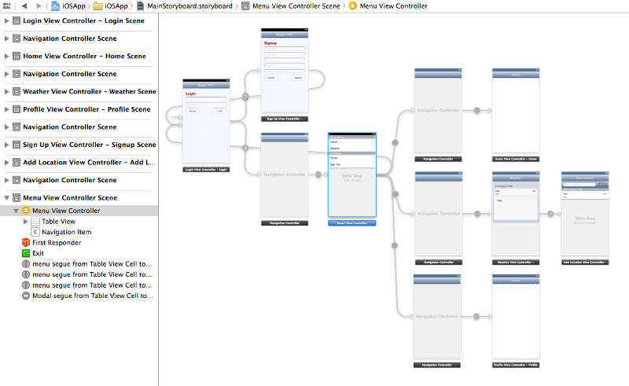

### POC using Apigee ###

### Adding Dropdown Menu ###

**Install DropdownMenu using CocoaPods**

Update content of [Podfile](iOSApp/Podfile) as shown below

```
...
target "iOSApp" do
pod 'ApigeeiOSSDK', '~> 2.0'
pod 'ionicons', '~> 1.1'
pod 'DropdownMenu', '~> 1.0'
end
...
```

Install Dependencies

```
pod install
```

**Create ViewController**

Create `MenuView Controller`

```
@interface MenuViewController : DropdownMenuController

@end
```

Update `MenuViewController.m`

```
...
- (void)viewDidAppear:(BOOL)animated
{
    [super viewDidAppear:animated];
    
    //[self setMenubarBackground:[UIColor greenColor]];
    
    [self.menuButton setTitle:nil forState:UIControlStateNormal];
    [self.menuButton setImage:[IonIcons imageWithIcon:icon_navicon size:30.0f color:[UIColor whiteColor]] forState:UIControlStateNormal];
    
    // Style menu buttons with IonIcons.
    for (UIButton *button in self.buttons)
    {
        if ([button.titleLabel.text isEqual: @"Home"])
        {
            //[IonIcons label:button.titleLabel setIcon:icon_home size:15.0f color:[UIColor whiteColor] sizeToFit:NO];
            [button setImage:[IonIcons imageWithIcon:icon_home size:20.0f color:[UIColor whiteColor]] forState:UIControlStateNormal];
            
        } else if ([button.titleLabel.text isEqual: @"Weather"])
        {
            //[IonIcons label:button.titleLabel setIcon:icon_home size:15.0f color:[UIColor whiteColor] sizeToFit:NO];
            [button setImage:[IonIcons imageWithIcon:icon_thermometer size:20.0f color:[UIColor whiteColor]] forState:UIControlStateNormal];
            
        } else if ([button.titleLabel.text isEqual: @"Setting"])
        {
            //[IonIcons label:button.titleLabel setIcon:icon_image size:15.0f color:[UIColor whiteColor] sizeToFit:NO];
            [button setImage:[IonIcons imageWithIcon:icon_settings size:20.0f color:[UIColor whiteColor]] forState:UIControlStateNormal];
            
        }
        
        // Set the title and icon position
        [button sizeToFit];
        button.titleEdgeInsets = UIEdgeInsetsMake(0, -button.imageView.frame.size.width-10, 0, button.imageView.frame.size.width);
        button.imageEdgeInsets = UIEdgeInsetsMake(0, button.titleLabel.frame.size.width, 0, -button.titleLabel.frame.size.width);
        
        // Set color to white
        [button setTitleColor:[UIColor whiteColor] forState:UIControlStateNormal];
    }
}
...

```

Create `MyView Controller`

```
@interface MyViewController : UIViewController

@end
```

Update `MyViewController.m`

```
...
- (void)viewDidAppear:(BOOL)animated
{
    [super viewDidAppear:animated];
    
    MenuViewController *menuController = (MenuViewController *) [self parentViewController];
    [menuController setMenubarTitle:self.title];
}
...
```

**Update Storyboard**

create `MenuViewController` with 

* Container View
* Menu
   * Button 1
   * Button 2
   * Button 2   
 * Menu Bar
 * Tap Gesture Recognizer

create Seque and embed ViewController

 * Add `dropdown` segue to Buttons connection to respective view controller.
 * Embed first ViewController into ContainerView.

as shown below


create `MyViewController` and establish connection as shown below



**Dropdown Menu**


