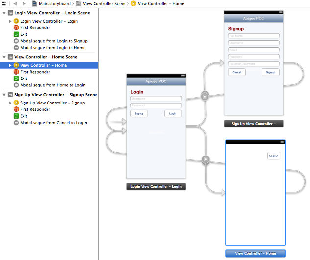

### POC using Apigee ###


### Adding Signup, Login and Logout ###

**Create ViewContollers**

Create following UIViewControllers

* `LoginViewController`
* `SignUpViewController`
* `HomeViewController`

[LoginViewController](iOSApp/iOSApp/LoginViewController.h) Definition

```
...
@interface LoginViewController : UIViewController <UITextFieldDelegate>

@property (weak, nonatomic) IBOutlet UITextField *username;
@property (weak, nonatomic) IBOutlet UITextField *password;

@property (strong, nonatomic) UITextField *currentTextField;
@property (weak, nonatomic) IBOutlet UIScrollView *scrollView;

- (IBAction) signupButton:(id) sender;
- (IBAction) loginButton:(id)sender;
...
@end
```

[SignUpViewController](iOSApp/iOSApp/SignUpViewController.h) Definition

```
...
@interface SignUpViewController : UIViewController <UITextFieldDelegate>

@property (weak, nonatomic) IBOutlet UITextField *username;
@property (weak, nonatomic) IBOutlet UITextField *fullname;
@property (weak, nonatomic) IBOutlet UITextField *email;
@property (weak, nonatomic) IBOutlet UITextField *password;
@property (weak, nonatomic) IBOutlet UITextField *repassword;

@property (strong, nonatomic) UITextField *currentTextField;
@property (weak, nonatomic) IBOutlet UIScrollView *scrollView;

- (IBAction)signupButton:(id)sender;

@end
...

```

[HomeViewController](iOSApp/iOSApp/HomeViewController.h) Definition

```
...
@interface HomeViewController : UIViewController

- (IBAction) logoutButton:(id)sender;

@end
...
```

**Create Storyboard**

Create main Storyboard as shown below



**ViewController Implementation**

[LoginViewController](iOSApp/iOSApp/LoginViewController.m) Implementation

```
#import "Global.h"

static NSString *kSequeSignup = @"signupSeque";
static NSString *kSequeLoginSuccess = @"loginSuccessSeque";

@interface LoginViewController ()

@property BOOL inLoginProcess;

@end

...

- (IBAction)signupButton:(id)sender
{
    [self performSegueWithIdentifier:kSequeSignup sender:self];
}

- (void) loginSuccess:(id) sender
{
    ApigeeUser *user = (ApigeeUser *) sender;
    NSString *message = [NSString stringWithFormat:@"Login as %@", [user username]];
    [Global alert:message withTitle:@"Login Successful" buttonTitle:@"OK"];
    
    [self performSegueWithIdentifier:kSequeLoginSuccess sender:sender];
}

- (void) loginFailure:(id) sender
{
    ApigeeClientResponse *response = (ApigeeClientResponse *) sender;
    [Global alert:[response response] withTitle:@"Login Failed" buttonTitle:@"Close"];
}

- (IBAction)loginButton:(id)sender
{
    if ([self inLoginProcess])
        return;
    
    NSString *username = [_username text];
    NSString *password = [_password text];
    
    if (([username length] >0) && ([password length] > 0))
    {
        Global *global = [Global sharedGlobal];
        self.inLoginProcess = YES;
        
        dispatch_async(dispatch_get_global_queue(DISPATCH_QUEUE_PRIORITY_DEFAULT, 0L),
                       ^(void){
                               if ([global login:username withPassword:password])
                               {
                                   [self performSelectorOnMainThread:@selector(loginSuccess) withObject:nil waitUntilDone:NO];
                               } else {
                                   ApigeeClientResponse *response = [global getLastResponse];
                                   
                                   [self performSelectorOnMainThread:@selector(loginFailure:) withObject:response waitUntilDone:YES];
                               }
                       });
        
    } else {
        [Global alert:@"Username and/or Password is missing" withTitle:@"Missing Credentials" buttonTitle:@"OK"];
    }
}

...

```

[SignUpViewController](iOSApp/iOSApp/SignUpViewController.m) Implementation

```
#import "Global.h"

static NSString *kSegueSignupSuccess = @"signupSuccessSeque";

@interface SignUpViewController ()

@property BOOL inSignupProcess;

@end
...
- (void) signupSuccess:(id) sender
{
    self.inSignupProcess = NO;
    
    Global *global = [Global sharedGlobal];
    ApigeeClientResponse *response = [global getLastResponse];
    ApigeeUser *user = (ApigeeUser *)[[response entities] objectAtIndex:0];   

    NSString *message = [NSString stringWithFormat:@"Login with your username: %@ and your password", [user username]];
    [Global alert: message withTitle:@"Signup Successful" buttonTitle:@"OK"];
    [self performSegueWithIdentifier:kSegueSignupSuccess sender:nil];
}

- (void) signupFailure:(id) sender
{
    ApigeeClientResponse *response = (ApigeeClientResponse *) sender;
    [Global alert:[response response] withTitle:@"Signup Failed" buttonTitle:@"Close"];
}

- (void) signupButton:(id)sender
{
    if ([self inSignupProcess])
        return;
    
    NSString *username = [_username text];
    NSString *fullname = [_fullname text];
    NSString *email = [_email text];
    NSString *password = [_password text];
    NSString *repassword = [_repassword text];
    
    if (![username length]>0)
    {
       [Global alert:@"Username is mandatory" withTitle:@"Missing Inputs" buttonTitle:@"OK"];
        return;
    }
    
    if (![password length] > 0)
    {
        [Global alert:@"Password is mandatory" withTitle:@"Missing Inputs" buttonTitle:@"OK"];
        return;
    }
    
    if (![password isEqualToString:repassword])
    {
        [Global alert:@"The password do not match!" withTitle:@"Password Error" buttonTitle:@"Close"];
        return;
    }
    
    Global *global = [Global sharedGlobal];
    self.inSignupProcess = YES;
    
    dispatch_async(dispatch_get_global_queue(DISPATCH_QUEUE_PRIORITY_DEFAULT, 0L),
                   ^(void){
                       if ([global signup:username email:email fullname:fullname password:password])
                       {
                           [self performSelectorOnMainThread:@selector(signupSuccess) withObject:nil waitUntilDone:NO];
                           
                       } else {
                           ApigeeClientResponse *response = [global getLastResponse];
                           [self performSelectorOnMainThread:@selector(signupFailure:) withObject:response waitUntilDone:YES];
                       }
                   });

...
```
Common `[View]ViewController` Implementation - making textfield visible as keyboard appears

```
- (void) keyboardDidShow:(NSNotification *)notification
{
    NSDictionary *info = [notification userInfo];
    CGSize kbSize = [[info objectForKey:UIKeyboardFrameEndUserInfoKey] CGRectValue].size;
    
    UIInterfaceOrientation orientation = [[UIApplication sharedApplication] statusBarOrientation];
    if (orientation == UIDeviceOrientationLandscapeLeft || orientation == UIDeviceOrientationLandscapeRight ) {
        CGSize size = kbSize;
        kbSize.height = size.width;
        kbSize.width = size.height;
    }
    
    UIEdgeInsets contentInsets = UIEdgeInsetsMake(0.0, 0.0, kbSize.height, 0.0);
    
    self.scrollView.contentInset = contentInsets;
    self.scrollView.scrollIndicatorInsets = contentInsets;
    
    CGFloat visibleHeight = self.view.frame.size.height - self.scrollView.frame.origin.y - kbSize.height;
    CGFloat textFieldOrigin = self.currentTextField.frame.origin.y;
    if (textFieldOrigin > visibleHeight)
    {
        CGPoint scrollPoint = CGPointMake(0.0, textFieldOrigin - visibleHeight/2);
        [self.scrollView setContentOffset:scrollPoint animated:YES];
        self.scrollView.scrollEnabled = NO;
    }
}

- (void) keyboardWillHide:(NSNotification *)notification
{
    UIEdgeInsets contentInsets = UIEdgeInsetsZero;
    
    [UIView animateWithDuration:0.4 animations:^{
        self.scrollView.contentInset = contentInsets;
    }];
    self.scrollView.scrollIndicatorInsets = contentInsets;
    self.scrollView.scrollEnabled = YES;
}

- (void) viewWillAppear:(BOOL)animated
{
    NSNotificationCenter *notifyCenter = [NSNotificationCenter defaultCenter];
    [notifyCenter addObserver:self selector:@selector(keyboardDidShow:) name:UIKeyboardDidShowNotification object:self.view.window];
    [notifyCenter addObserver:self selector:@selector(keyboardWillHide:) name:UIKeyboardWillHideNotification object:self.view.window];
        
    [super viewWillAppear:animated];
}

- (void) viewWillDisappear:(BOOL)animated
{
    NSNotificationCenter *notifyCenter = [NSNotificationCenter defaultCenter];
    [notifyCenter removeObserver:self name:UIKeyboardDidShowNotification object:nil];
    [notifyCenter removeObserver:self name:UIKeyboardWillHideNotification object:nil];
    
    [self.view endEditing:YES];
    
    [super viewWillDisappear:animated];
}

- (void)prepareForSegue:(UIStoryboardSegue *)segue sender:(id)sender
{
    // Get the new view controller using [segue destinationViewController].
    // Pass the selected object to the new view controller.
    
    [self.currentTextField resignFirstResponder];
}


- (void) textFieldDidBeginEditing:(UITextField *)textField
{
    self.currentTextField = textField;
}

- (void) textFieldDidEndEditing:(UITextField *)textField
{
    self.currentTextField = nil;
    [textField resignFirstResponder];
}

- (BOOL)textFieldShouldReturn:(UITextField *)textFieldView {
    [textFieldView resignFirstResponder];
    return YES;
}
```


`HomeViewController` Implementation

```
...
- (IBAction) logoutButton:(id)sender;
{
     Global *global = [Global sharedGlobal];
    [global logOut];
    [self performSegueWithIdentifier:kSequeLogout sender:sender];
}
...
```


