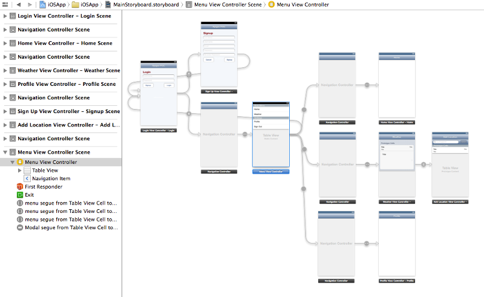

### POC using Apigee ###

### Adding Sliding Menu ###


**Create MenuViewController**

Create [MenuViewController](iOSApp/iOSApp/MenuViewController.h) Definition

```
#import <UIKit/UIKit.h>

@interface MenuViewController : UITableViewController

@end

@interface MenuSegue : UIStoryboardSegue

@end
```

Create [MenuViewController](iOSApp/iOSApp/MenuViewController.m) Implmentation

```
#import "MenuViewController.h"
#import "Global.h"

#define kExposedWidth 200.0

static NSString *kSequeMenuHome = @"menuHomeSegue";
static NSString *kSequeLogout = @"logoutSegue";

@interface MenuViewController ()

@property (strong, nonatomic) UIViewController *currentViewController;
@property (assign, nonatomic) BOOL isMenuVisible;
@property (strong, nonatomic) NSString *currentSegueIdentifier;

@end

@implementation MenuViewController


- (id)initWithStyle:(UITableViewStyle)style
{
    self = [super initWithStyle:style];
    if (self) {
        // Custom initialization
    }
    return self;
}

- (void)viewDidLoad
{
    [super viewDidLoad];
    
    // Uncomment the following line to preserve selection between presentations.
    // self.clearsSelectionOnViewWillAppear = NO;
    
    // Uncomment the following line to display an Edit button in the navigation bar for this view controller.
    //self.navigationItem.rightBarButtonItem = self.editButtonItem;
    
    [self.navigationController setNavigationBarHidden:YES animated:NO];
    self.isMenuVisible = NO;
}

-(void)viewDidAppear:(BOOL)animated
{
    [super viewDidAppear:animated];
    [self performSegueWithIdentifier:kSequeMenuHome sender: self];
    
}


- (void)didReceiveMemoryWarning
{
    [super didReceiveMemoryWarning];
    // Dispose of any resources that can be recreated.
}

/*
 #pragma mark - Navigation
 
 // In a storyboard-based application, you will often want to do a little preparation before navigation
 */
- (void)prepareForSegue:(UIStoryboardSegue *)segue sender:(id)sender
{
    if ([segue.identifier isEqualToString:kSequeLogout])
    {
        Global *global = [Global sharedGlobal];
        [global logOut];
        
    } else {

        self.currentSegueIdentifier = segue.identifier;
        
        UINavigationController *destinationViewController = segue.destinationViewController;
        
        UIBarButtonItem *menuButtonItem = [[UIBarButtonItem alloc] initWithTitle:@"Menu" style:UIBarButtonItemStylePlain target:self action:@selector(toggleMenuVisibility:)];
        
        destinationViewController.topViewController.navigationItem.leftBarButtonItems = [@[menuButtonItem] arrayByAddingObjectsFromArray:destinationViewController.topViewController.navigationItem.leftBarButtonItems];
        [destinationViewController.navigationController setNavigationBarHidden:NO animated:NO];

    }
    [super prepareForSegue:segue sender:sender];
}

- (BOOL)shouldPerformSegueWithIdentifier:(NSString *)identifier sender:(id)sender {
    if ([self.currentSegueIdentifier isEqual:identifier]) {
        //Dont perform segue, if visible ViewController is already the destination ViewController
        
        self.isMenuVisible = NO;
        [self adjustContentFrameAccordingToMenuVisibility];
        return NO;
    }
    
    return YES;
}

- (IBAction)toggleMenuVisibility:(id)sender
{
    self.isMenuVisible = !self.isMenuVisible;
    [self adjustContentFrameAccordingToMenuVisibility];
}

- (void) adjustContentFrameAccordingToMenuVisibility
{
    UIViewController *viewController = self.currentViewController;
    if (viewController)
    {
        CGSize size = viewController.view.frame.size;
        
        if (self.isMenuVisible)
        {
            [UIView animateWithDuration:0.5 animations:^{
                viewController.view.frame = CGRectMake(kExposedWidth, 0, size.width, size.height);
                
            }];
        } else {
            [UIView animateWithDuration:0.5 animations:^{
                viewController.view.frame = CGRectMake(0, 0, size.width, size.height);
            }];
        }
    }
}

- (void)tableView:(UITableView *)tableView didSelectRowAtIndexPath:(NSIndexPath *)indexPath
{
    [tableView deselectRowAtIndexPath:indexPath animated:NO];
}

@end

@implementation MenuSegue

-(void) perform
{
    MenuViewController *containerViewController = (MenuViewController *) self.sourceViewController;
    
    UIViewController *viewController = containerViewController.currentViewController;
    UIViewController *destinationViewController = self.destinationViewController;
    
    if (viewController == nil)
    {
        destinationViewController.view.frame = [self offScreenFrame:containerViewController.view.bounds.size];
        
        [containerViewController addChildViewController:destinationViewController];
        [containerViewController.view addSubview:destinationViewController.view];
        
        containerViewController.isMenuVisible = NO;
        containerViewController.currentViewController = destinationViewController;
        [containerViewController adjustContentFrameAccordingToMenuVisibility];
        
        [destinationViewController didMoveToParentViewController:containerViewController];
        
    } else {
        
        destinationViewController.view.frame = [self offScreenFrame:viewController.view.bounds.size];
        
        CGRect visibleFrame = viewController.view.bounds;
        
        
        [viewController willMoveToParentViewController:nil];
        
        [containerViewController addChildViewController:destinationViewController];
        
        [[UIApplication sharedApplication] beginIgnoringInteractionEvents];
        
        [containerViewController transitionFromViewController:viewController
                                             toViewController:destinationViewController
                                                     duration:0.5 options:0
                                                   animations:^{
                                                       viewController.view.frame = [self offScreenFrame:viewController.view.bounds.size];
                                                   }
                                                   completion:^(BOOL finished) {
                                                       [UIView animateWithDuration:0.5
                                                                        animations:^{
                                                                            [viewController.view removeFromSuperview];
                                                                            [containerViewController.view addSubview:destinationViewController.view];
                                                                            destinationViewController.view.frame = visibleFrame;
                                                                            [[UIApplication sharedApplication] endIgnoringInteractionEvents];
                                                                        }];
                                                       [destinationViewController didMoveToParentViewController:containerViewController];
                                                       [viewController removeFromParentViewController];
                                                       containerViewController.isMenuVisible = NO;
                                                       containerViewController.currentViewController = destinationViewController;
                                                       
                                                   }];
    }
    
    
}

- (CGRect) offScreenFrame:(CGSize) size
{
    return CGRectMake(size.width, 0,
                      size.width, size.height);
}

@end
```

**Update Main Storyboard**

Update Main Storyboard as shown below




