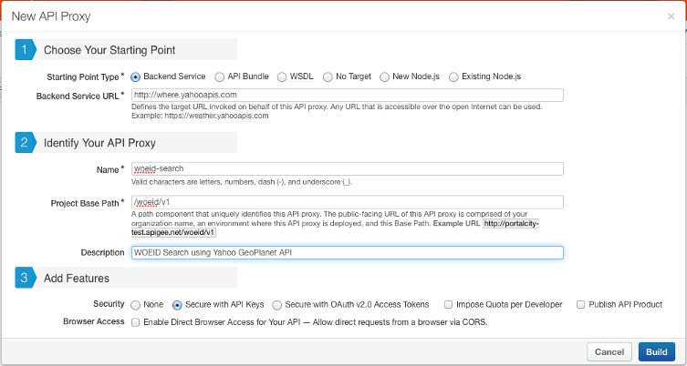
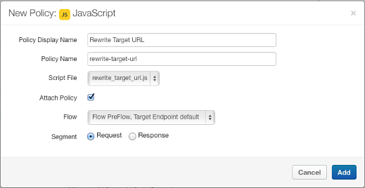

### POC using Apigee ###


### Weather API ###

Creating weather API using **Yahoo API**

#### Yahoo API - Details####

Request: [http://weather.yahooapis.com/forecastrss?w=23424948&u=c](http://weather.yahooapis.com/forecastrss?w=23424948&u=c)

Response  

```
<rss xmlns:yweather="http://xml.weather.yahoo.com/ns/rss/1.0" xmlns:geo="http://www.w3.org/2003/01/geo/wgs84_pos#" version="2.0">
<channel>
  <title>Yahoo! Weather - Singapore, SG</title>
  <link>http://us.rd.yahoo.com/dailynews/rss/weather/Singapore__SG/*http://weather.yahoo.com/forecast/SNXX0006_c.html</link>
  <description>Yahoo! Weather for Singapore, SG</description>
  <language>en-us</language>
  <lastBuildDate>Thu, 03 Jul 2014 12:59 pm SGT</lastBuildDate>
  <ttl>60</ttl>
  <yweather:location city="Singapore" region="" country="Singapore"/>
  <yweather:units temperature="C" distance="km" pressure="mb" speed="km/h"/>
  <yweather:wind chill="29" direction="190" speed="12.87"/>
  <yweather:atmosphere humidity="74" visibility="9.99" pressure="982.05" rising="2"/>
  <yweather:astronomy sunrise="7:01 am" sunset="7:13 pm"/>
  <image>
    <title>Yahoo! Weather</title>
    <width>142</width>
    <height>18</height>
    <link>http://weather.yahoo.com</link>
    <url>http://l.yimg.com/a/i/brand/purplelogo//uh/us/news-wea.gif</url>
  </image>
  <item>
    <title>Conditions for Singapore, SG at 12:59 pm SGT</title>
    <geo:lat>1.37</geo:lat>
    <geo:long>103.83</geo:long>
    <link>http://us.rd.yahoo.com/dailynews/rss/weather/Singapore__SG/*http://weather.yahoo.com/forecast/SNXX0006_c.html</link>
    <pubDate>Thu, 03 Jul 2014 12:59 pm SGT</pubDate>
    <yweather:condition text="Mostly Cloudy" code="28" temp="29" date="Thu, 03 Jul 2014 12:59 pm SGT"/>
    <description>
      <![CDATA[
<br />
<b>Current Conditions:</b><br />
Mostly Cloudy, 29 C<BR />
<BR />
<b>Forecast:</b><BR />
Thu - Thunderstorms. High: 29 Low: 27<br />
Fri - Scattered Thunderstorms. High: 29 Low: 27<br />
Sat - Thunderstorms. High: 29 Low: 27<br />
Sun - Thunderstorms. High: 29 Low: 26<br />
Mon - Thunderstorms. High: 29 Low: 26<br />
<br />
<a href="http://us.rd.yahoo.com/dailynews/rss/weather/Singapore__SG/*http://weather.yahoo.com/forecast/SNXX0006_c.html">Full Forecast at Yahoo! Weather</a><BR/>
<BR/>
(provided by <a href="http://www.weather.com" >The Weather Channel</a>)<br/>
]]>
    </description>
    <yweather:forecast day="Thu" date="3 Jul 2014" low="27" high="29" text="Thunderstorms" code="4"/>
    <yweather:forecast day="Fri" date="4 Jul 2014" low="27" high="29" text="Scattered Thunderstorms" code="38"/>
    <yweather:forecast day="Sat" date="5 Jul 2014" low="27" high="29" text="Thunderstorms" code="4"/>
    <yweather:forecast day="Sun" date="6 Jul 2014" low="26" high="29" text="Thunderstorms" code="4"/>
    <yweather:forecast day="Mon" date="7 Jul 2014" low="26" high="29" text="Thunderstorms" code="4"/>
    <guid isPermaLink="false">SNXX0006_2014_07_07_7_00_SGT</guid>
  </item>
</channel>
</rss>
```

* **WOEID Search**  

Request: [http://where.yahooapis.com/v1/places.q('singapore')?appid=[API-KEY]](http://where.yahooapis.com/v1/places.q\('singapore'\)?appid=dj0yJmk9RlNwTUdndXY3ZVd2JmQ9WVdrOVdrbHpNbUZpTkc4bWNHbzlNQS0tJnM9Y29uc3VtZXJzZWNyZXQmeD01NA--)

Response:

```
<places xmlns="http://where.yahooapis.com/v1/schema.rng" xmlns:yahoo="http://www.yahooapis.com/v1/base.rng" yahoo:start="0" yahoo:count="1" yahoo:total="4">
  <place yahoo:uri="http://where.yahooapis.com/v1/place/23424948" xml:lang="en-US">
  <woeid>23424948</woeid>
  <placeTypeName code="12">Country</placeTypeName>
  <name>Singapore</name>
  <country type="Country" code="SG" woeid="23424948">Singapore</country>
  <admin1/>
  <admin2/>
  <admin3/>
  <locality1/>
  <locality2/>
  <postal/>
  <centroid>
    <latitude>1.365580</latitude>
    <longitude>103.827713</longitude>
  </centroid>
  <boundingBox>
    <southWest>
      <latitude>1.115800</latitude>
      <longitude>103.618248</longitude>
    </southWest>
    <northEast>
      <latitude>1.470620</latitude>
      <longitude>104.408470</longitude>
    </northEast>
  </boundingBox>
  <areaRank>6</areaRank>
  <popRank>0</popRank>
  <timezone type="Time Zone" woeid="28350856">Asia/Singapore</timezone>
  </place>
</places>
```


#### Weather API ####
Simplyfing weather API on Apigee Edge

**WOEID Search** - Where On Earth ID 

Request: **q => location name**

`http://[organization]-[site].apigee.net/woeid/v1/search?q=queens&apikey=[API-KEY]`

Response: **woeid => where on earch ID of the location**

```
{"places":[{
  "woeid":12589352,
  "placeType":"County",
  "name":"Queens",
  "country":"United States",
  "timezone":"America/New_York"
  }]
}
```

**Weather Forecase**

Request: **w => woeid, u => units**

`http://[organization]-[site].apigee.net/weather/v1/forecast?w=12589352&u=c&apikey=[API-KEY]`

Response: **u => units, condition => weather, forecast => 5 day forecast***

```
{"forecast":{
   "woeid":"12589352",
   "units":{
     "temperature":"C",
     "distance":"km",
     "pressure":"mb",
     "speed":"km/h"
   },
   "wind":{
     "chill":22,
     "direction":190,
     "speed":22.53
   },
   "atmosphere":{
     "humidity":73,
     "visibility":16.09,
     "pressure":1014.4,
     "rising":2
   },
   "astronomy":{
     "sunrise":"5:29 am",
     "sunset":"8:27 pm"
   },
   "image":{
     "width":142,
     "height":18,
     "url":"http://l.yimg.com/a/i/brand/purplelogo//uh/us/news-wea.gif"
   },
   "condition":{
     "text":"Partly Cloudy",
     "code":29,
     "temp":22,
     "date":"Sun, 06 Jul 2014 10:50 pm EDT"
   },
   "location":{
     "city":"Queens",
     "region":"NY",
     "country":
     "United States"
   },
   "forecast":[{
     "day":"Sun","date":"6 Jul 2014",
     "low":21,
     "high":28,
     "text":"Partly Cloudy",
     "code":29
   },{
     "day":"Mon","date":"7 Jul 2014",
     "low":23,
     "high":32,
     "text":"Mostly Sunny",
     "code":34
   },{
     "day":"Tue","date":"8 Jul 2014",
     "low":24,
     "high":33,
     "text":"Isolated Thunderstorms",
     "code":37
   },{
     "day":"Wed","date":"9 Jul 2014",
     "low":21,
     "high":29,
     "text":"Isolated Thunderstorms",
     "code":37
   },{
     "day":"Thu","date":"10 Jul 2014",
     "low":19,
     "high":27,
     "text":"Isolated Thunderstorms",
     "code":37
   }]
 }
}
```

**Create New API Proxy**

* Create New API Proxy (WOEID Search) as shown below



* Build Result will be as shown below


* Weather API will be created as shown below


* Add Policy `Extract Variables - place` as shown below


```
<ExtractVariables async="false" continueOnError="false" enabled="true" name="extract-variables-place">
    <DisplayName>Extract Variables - place</DisplayName>
    <QueryParam name="q">
        <Pattern ignoreCase="false">{place}</Pattern>
    </QueryParam>
    <VariablePrefix>vars</VariablePrefix>
    <IgnoreUnresolvedVariables>false</IgnoreUnresolvedVariables>
</ExtractVariables>
```

* Add Javascript `rewrite_target_url.js` as shown below


```
var host = context.getVariable("target.url");
var place = context.getVariable("vars.place");

var view = "long";
var format= "json";
var appid = "dj0yJmk9RlNwTUdndXY3ZVd2JmQ9WVdrOVdrbHpNbUZpTkc4bWNHbzlNQS0tJnM9Y29uc3VtZXJzZWNyZXQmeD01NA--";

var target = host + "/v1/places.q('" + place + "')" 
  + "?view=" + view 
  + "&format=" + format
  + "&appid=" + appid;

context.setVariable("target.url", target);
context.setVariable("target.copy.pathsuffix", false);
context.setVariable("target.copy.queryparams", false);
```

* Add Javascript Policy `Rewrite Target URL` as shown below



* Add Javascript `minimize_json.js` as shown below


```
var originalResponse = JSON.parse(context.proxyResponse.content);
var places = originalResponse.places;
var place = [];

for (var index = 0; index < places.place.length; index++){
  place[index] = {
    woeid: places.place[index].woeid,
    placeType: places.place[index].placeTypeName,
    name: places.place[index].name,
    country: places.place[index].country,
    timezone: places.place[index].timezone
  }
}

var minimizeResponse = {
  places: place
};
context.proxyResponse.content = JSON.stringify(minimizeResponse);
```

* Add Javascript Policy `Minimize JSON` as shown below


* Trace WOEID Search (without API-KEY) shown below


* Create Weather API Product as shown below


* Add Developer as shown below


* Add Developer App as shown below


* View Developer API-KEY as shown below


* Trace WOEID Search (with API-KEY) shown below


* Publish WOEID Search to Production shown below


* Similarly Create 
  * Create New API Proxy (Weather Forecast) with target URl `http://weather.yahooapis.com/`
  * Add Policy `Extract Variables - woeid, unit`

  ```
<ExtractVariables async="false" continueOnError="false" enabled="true" name="extract-variables-place">
    <DisplayName>Extract Variables - woeid</DisplayName>
    <QueryParam name="w">
        <Pattern ignoreCase="false">{oweid}</Pattern>
    </QueryParam>
    <QueryParam name="u">
        <Pattern ignoreCase="false">{unit}</Pattern>
    </QueryParam>
    <VariablePrefix>vars</VariablePrefix>
    <IgnoreUnresolvedVariables>false</IgnoreUnresolvedVariables>
</ExtractVariables>
  ```
  
  * Add Javascript `rewrite_target_url.js` 
  
  ```
var host = context.getVariable("target.url");
var woeid = context.getVariable("vars.woeid");
var unit = context.getVariable("vars.unit");
var target = host + "/forecastrss" + "?w=" + woeid + "&u=" + unit;
context.setVariable("target.url", target);
context.setVariable("target.copy.pathsuffix", false);
context.setVariable("target.copy.queryparams", false);
  ``` 
  
  * Add Javascript Policy `Rewrite Target URL`

  * Add Javascript `minimize_json.js`

```
var originalResponse = JSON.parse(context.proxyResponse.content);
var woeid = context.getVariable("vars.woeid");

var channel = originalResponse.rss.channel;
var forecast = [];

for (var index = 0; index < channel.item.forecast.length; index++){
  forecast[index] = {
    day: channel.item.forecast[index].day,
    date: channel.item.forecast[index].date,
    low: channel.item.forecast[index].low,
    high: channel.item.forecast[index].high,
    text: channel.item.forecast[index].text,
    code: channel.item.forecast[index].code,
  };
}
var description = channel.item.description;
var match =  description.match(//i);
var url = match[1];

var minimizedResponse = { 
  forecast: {
    woeid: woeid,
    units: {
      temperature: channel.units.temperature,
      distance: channel.units.distance,
      pressure: channel.units.pressure,
      speed: channel.units.speed,
    },
    wind: {
      chill: channel.wind.chill,
      direction: channel.wind.direction,
      speed: channel.wind.speed
    },
    atmosphere: {
      humidity: channel.atmosphere.humidity,
      visibility: channel.atmosphere.visibility,
      pressure: channel.atmosphere.pressure,
      rising: channel.atmosphere.rising
    },
    astronomy: {
      sunrise: channel.astronomy.sunrise,
      sunset: channel.astronomy.sunset
    },
    condition: {
      text: channel.item.condition.text,
      code: channel.item.condition.code,
      image: url,
      temp: channel.item.condition.temp,
      date: channel.item.condition.date
    },
    location: {
      city: channel.location.city,
      region: channel.location.region,
      country: channel.location.country 
    },
    forecast: forecast
  }
};

context.proxyResponse.content = JSON.stringify(minimizedResponse);
```

  * Add XML-to-JSON Policy `XML-to-JSON` as shown below
  
  

  * Add Javascript Policy `Minimize JSON`


  * Update Weather API Product as shown below

  

  * Update Developer App as shown below

  * Publish Weather Forecast to Production 
  
**Test using Browser**
  
`http://portalcity-prod.apigee.net/woeid/v1/search?q=singapore&apikey=zgkZmV9GOEKZljFpG4Ko5cpqRok9zA0x`


`http://portalcity-prod.apigee.net/weather/v1/forecast?w=23424948&u=c&apikey=zgkZmV9GOEKZljFpG4Ko5cpqRok9zA0x`


 